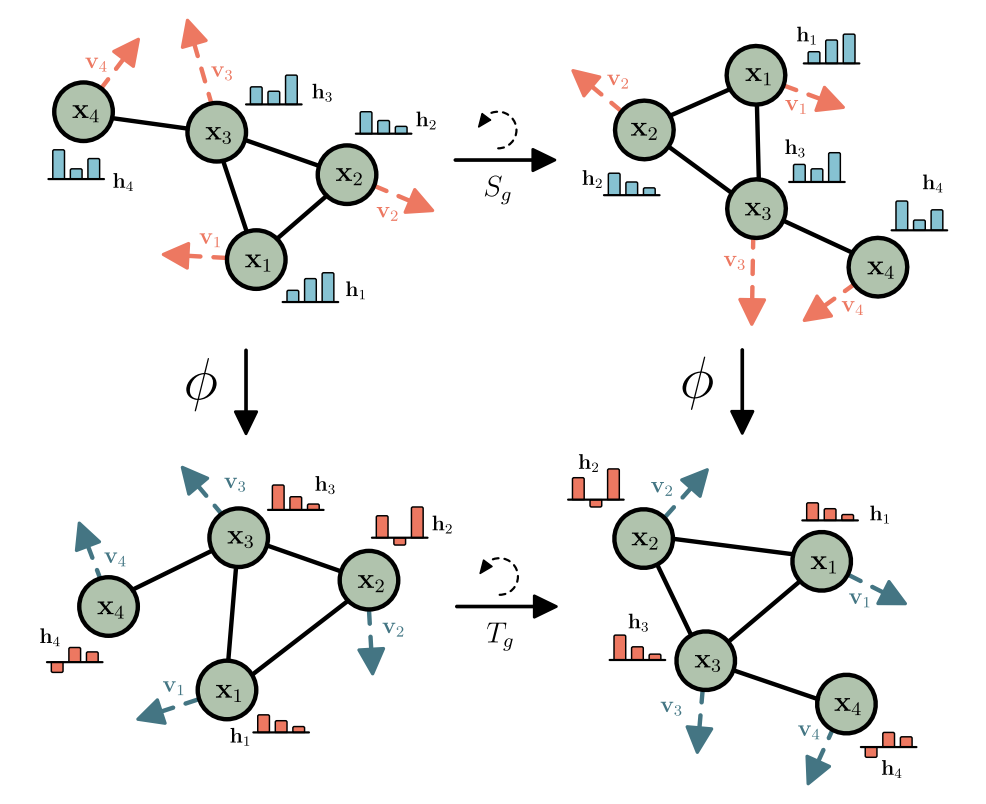

# Simple implementation of Equivariant GNN

- A short implementation of [E(n) Equivariant Graph Neural Networks](https://arxiv.org/pdf/2102.09844.pdf) for [HOMO energy](https://en.wikipedia.org/wiki/HOMO_and_LUMO) prediction.
- Just 50 lines of code; 
- The implementation is based on pure PyTorch & Numpy, it has no external packages (like PyTorch-geometric).
- Closely matches the Mean Absolute Error reported in the paper.

